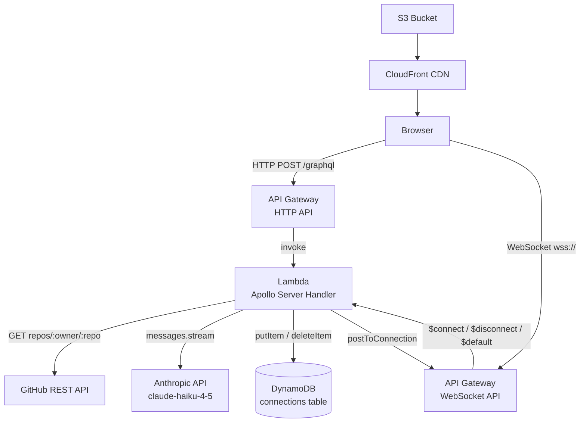

# Step 2 — 技術設計

## 系統架構圖



## 請求流程

### Query — getRepo
```
Browser → HTTP POST → Lambda → GitHub REST API → 回傳 RepoInfo
```

### Mutation — analyzeRepo
```
Browser → HTTP POST → Lambda
  → 產生 sessionId
  → 非同步啟動 streamAnalysis()
    → Anthropic streaming
    → 每個 chunk → 查 DynamoDB 找 connectionId
    → postToConnection 推送 chunk 到 WebSocket
  → 立即回傳 sessionId 給前端
```

### Subscription — onAnalysisUpdate
```
Browser → WS connect → Lambda $connect handler → 存 connectionId 到 DynamoDB
Browser → 訂閱 onAnalysisUpdate(sessionId)
  → 收到 Lambda postToConnection 推送的 chunks
  → done: true 時結束
Browser 離開 → WS disconnect → Lambda $disconnect → 刪 DynamoDB connectionId
```

---

## 模組拆解

### backend/src/

| 模組 | 檔案 | 職責 |
|------|------|------|
| Schema | `schema.ts` | GraphQL type definitions |
| Query Resolver | `resolvers/query.ts` | getRepo — 呼叫 GitHub service |
| Mutation Resolver | `resolvers/mutation.ts` | analyzeRepo — 產生 sessionId，啟動 streaming |
| Subscription Resolver | `resolvers/subscription.ts` | onAnalysisUpdate — 訂閱 PubSub |
| GitHub Service | `services/github.ts` | 封裝 GitHub REST API 呼叫 |
| Anthropic Service | `services/anthropic.ts` | 封裝 Anthropic streaming，發布到 PubSub |
| WebSocket Service | `services/websocket.ts` | 封裝 postToConnection，查 DynamoDB connectionId |
| PubSub | `pubsub.ts` | graphql-subscriptions PubSub 實例 |
| Lambda Handler | `handler.ts` | HTTP + WebSocket 路由進入點 |

### frontend/src/

| 模組 | 檔案 | 職責 |
|------|------|------|
| App | `App.tsx` | 狀態管理，串接三個元件 |
| RepoInput | `components/RepoInput.tsx` | owner/repo 輸入表單，觸發 Query |
| CommitList | `components/CommitList.tsx` | 顯示 commits 列表 |
| AiSummary | `components/AiSummary.tsx` | 訂閱 Subscription，即時顯示串流文字 |
| GraphQL Operations | `graphql/operations.ts` | Query / Mutation / Subscription 定義 |
| Apollo Client | `graphql/client.ts` | HTTP link + WebSocket link 設定 |

### infra/lib/

| 模組 | 職責 |
|------|------|
| `repo-radar-stack.ts` | DynamoDB table、Lambda function、HTTP API、WebSocket API、S3、CloudFront |

---

## 資料模型

### GraphQL Schema

```graphql
type Commit {
  sha: String!
  message: String!
  author: String!
  timestamp: String!
}

type RepoInfo {
  name: String!
  description: String
  stars: Int!
  forks: Int!
  openIssues: Int!
  commits: [Commit!]!
}

type AnalysisChunk {
  sessionId: String!
  chunk: String!
  done: Boolean!
}

type Query {
  getRepo(owner: String!, repo: String!): RepoInfo!
}

type Mutation {
  analyzeRepo(owner: String!, repo: String!): String!
}

type Subscription {
  onAnalysisUpdate(sessionId: String!): AnalysisChunk!
}
```

### DynamoDB Schema

Table name: `RepoRadarConnections`

| 欄位 | 型別 | 說明 |
|------|------|------|
| `connectionId` | String (PK) | WebSocket connection ID |
| `sessionId` | String | 對應的分析 session |
| `ttl` | Number | Unix timestamp，連線後 2 小時自動清除 |

---

## 關鍵技術決策

### 決策 1：兩個 API Gateway（HTTP + WebSocket）而非單一 WebSocket

**選擇**：HTTP API 處理 Query/Mutation，WebSocket API 處理 Subscription

**理由**：Lambda 無狀態，無法維持長連線。HTTP API 成本低、延遲低，適合 Query/Mutation。WebSocket API 專門管理連線生命週期。

**備選**：全部走 WebSocket — 複雜度高，HTTP 請求也要包成 WebSocket message，不值得。

---

### 決策 2：PubSub 在 Lambda 內（非 Redis）

**選擇**：使用 `graphql-subscriptions` 的 in-memory PubSub

**理由**：Demo 專案，單一 Lambda instance 足夠。不需要跨 instance 的訊息傳遞。

**備選**：Redis PubSub — 需要 ElastiCache，成本高，Demo 不需要。

**風險**：Lambda 冷啟動時 PubSub instance 重建，但因為 Mutation 和 Subscription 在同一個 Lambda 執行，不受影響。

---

### 決策 3：Mutation 立即回傳 sessionId，streaming 非同步執行

**選擇**：`analyzeRepo` 立即回傳 sessionId，然後非同步跑 Anthropic streaming

**理由**：GraphQL Mutation 需要同步回傳，不能等 streaming 結束。前端拿到 sessionId 後立即訂閱 Subscription 等待 chunks。

**風險**：前端訂閱比 Lambda 開始推送慢的 race condition。
**對策**：前端收到 sessionId 後立即訂閱，Anthropic API 首個 token 通常需要 0.5-1s，時間足夠。

---

## UI 設計

### 整體頁面佈局

```
┌─────────────────────────────────────────────────────┐
│  🔭 RepoRadar                                        │  ← Header
├─────────────────────────────────────────────────────┤
│                                                     │
│  ┌─────────────────────────────────────────────┐   │
│  │  Owner  [facebook    ]  Repo [react    ]    │   │  ← RepoInput
│  │                          [ 查詢 Repo ]       │   │
│  └─────────────────────────────────────────────┘   │
│                                                     │
│  ┌──────────────────────┐  ┌─────────────────────┐ │
│  │  Repo 資訊            │  │  AI 摘要             │ │
│  │  ─────────────────   │  │  ─────────────────  │ │
│  │  ⭐ 228k stars        │  │  [ 開始 AI 分析 ]    │ │  ← 左右分欄
│  │  🍴 46k forks         │  │                     │ │
│  │  ❗ 892 issues        │  │  （分析結果顯示區）   │ │
│  ├──────────────────────┤  └─────────────────────┘ │
│  │  最新 Commits         │                          │
│  │  ─────────────────   │                          │
│  │  • feat: xxx  @user  │                          │  ← CommitList
│  │    2026-05-30        │                          │
│  │  • fix: yyy   @user  │                          │
│  │    2026-05-29        │                          │
│  │  • ...               │                          │
│  └──────────────────────┘                          │
└─────────────────────────────────────────────────────┘
```

---

### RepoInput 元件狀態

**初始狀態**
```
┌─────────────────────────────────────────────────┐
│  Owner  [          ]   Repo  [          ]       │
│                              [  查詢 Repo  ]    │
└─────────────────────────────────────────────────┘
```

**載入中**
```
┌─────────────────────────────────────────────────┐
│  Owner  [ facebook ]   Repo  [ react    ]       │
│                              [  查詢中...  ]    │  ← 按鈕 disabled
└─────────────────────────────────────────────────┘
```

**錯誤**
```
┌─────────────────────────────────────────────────┐
│  Owner  [ faceboook]   Repo  [ react    ]       │
│  ⚠ 找不到此 repo，請確認名稱是否正確              │
│                              [  查詢 Repo  ]    │
└─────────────────────────────────────────────────┘
```

---

### CommitList 元件狀態

**有資料**
```
┌──────────────────────────────────────────────────┐
│  最新 Commits                                    │
│  ──────────────────────────────────────────────  │
│  ● feat(compiler): add new optimization pass     │
│    @poteto  ·  2026-05-30 14:22                  │
│                                                  │
│  ● fix(hooks): resolve stale closure issue       │
│    @gaearon  ·  2026-05-29 09:11                 │
│                                                  │
│  ● chore: bump version to 19.1.0                 │
│    @sebmarkbage  ·  2026-05-28 17:45             │
│  ...（共 10 筆）                                 │
└──────────────────────────────────────────────────┘
```

---

### AiSummary 元件狀態

**初始（查詢完成後顯示）**
```
┌──────────────────────────────────────────────────┐
│  AI 摘要                                         │
│  ──────────────────────────────────────────────  │
│                                                  │
│         [ 🤖 開始 AI 分析 ]                      │
│                                                  │
└──────────────────────────────────────────────────┘
```

**串流中**
```
┌──────────────────────────────────────────────────┐
│  AI 摘要                          ● 分析中...    │
│  ──────────────────────────────────────────────  │
│                                                  │
│  本週開發重點集中在編譯器優化與 Hooks             │
│  穩定性改善。主要貢獻者為 @poteto 與              │
│  @gaearon，共合併 8 個 PR▌                       │  ← ▌ 游標閃爍
│                                                  │
└──────────────────────────────────────────────────┘
```

**完成**
```
┌──────────────────────────────────────────────────┐
│  AI 摘要                          ✅ 分析完成    │
│  ──────────────────────────────────────────────  │
│                                                  │
│  本週開發重點集中在編譯器優化與 Hooks             │
│  穩定性改善。主要貢獻者為 @poteto 與              │
│  @gaearon，共合併 8 個 PR。                      │
│                                                  │
│  ⚠ 潛在風險：連續 3 個 commit 修改同一檔案       │
│  可能存在未解決的設計分歧。                       │
│                                                  │
│         [ 🤖 重新分析 ]                          │
└──────────────────────────────────────────────────┘
```

---

### 色彩與樣式規範（Tailwind）

| 元素 | Tailwind class |
|------|---------------|
| 背景 | `bg-gray-950` |
| 卡片 | `bg-gray-900 rounded-xl border border-gray-800` |
| 主色（按鈕） | `bg-violet-600 hover:bg-violet-500` |
| 文字主色 | `text-gray-100` |
| 文字次色 | `text-gray-400` |
| 串流游標 | `animate-pulse inline-block w-2 h-4 bg-violet-400` |
| 狀態 badge（分析中） | `bg-violet-900 text-violet-300` |
| 狀態 badge（完成） | `bg-green-900 text-green-300` |

---

## 已知風險與對策

| 風險 | 影響 | 對策 |
|------|------|------|
| GitHub API rate limit（未認證 60 req/hr） | Query 超過限制報錯 | 使用 Personal Access Token（5000 req/hr） |
| WebSocket 連線在 AI streaming 期間斷線 | 前端收不到後續 chunks | Demo 層級接受，重新操作即可 |
| Lambda cold start 延遲 | 首次請求慢 2-3s | Demo 可接受，說明時提前 warm up |
| Anthropic API streaming 超過 Lambda timeout | streaming 中斷 | 設定 Lambda timeout 為 30s，haiku 速度夠快 |
